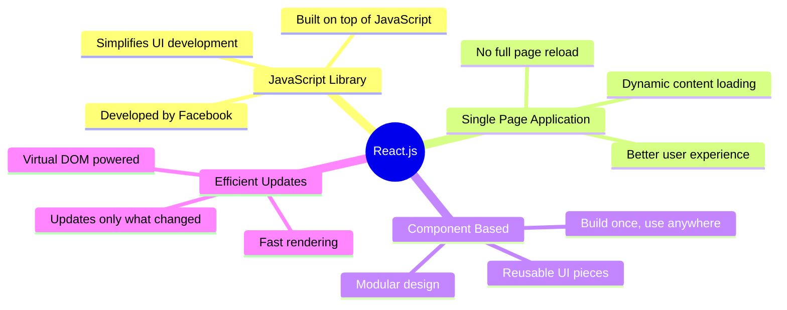
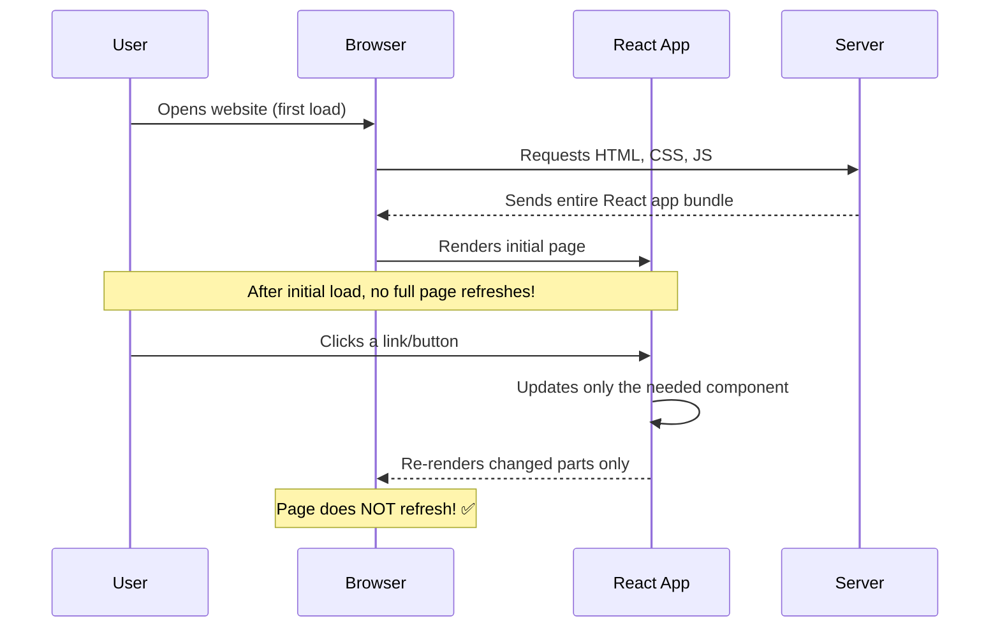
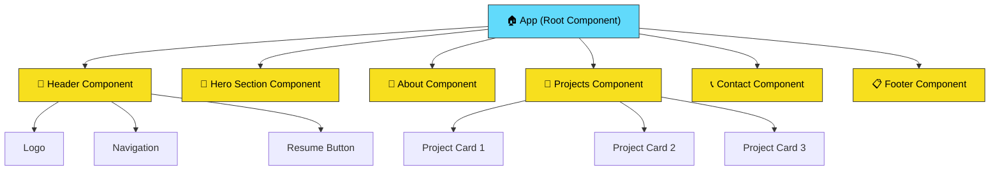
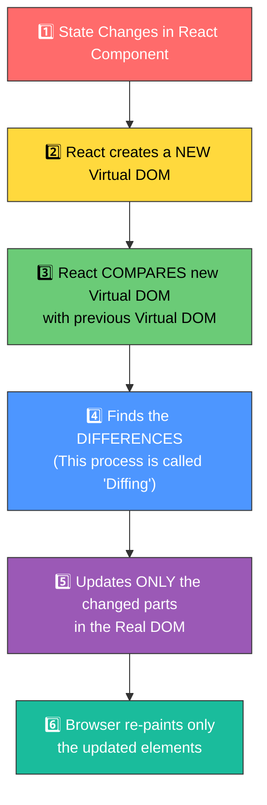
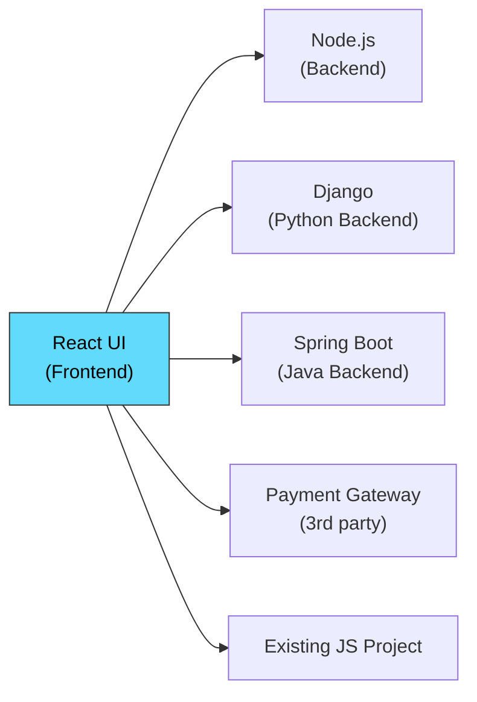
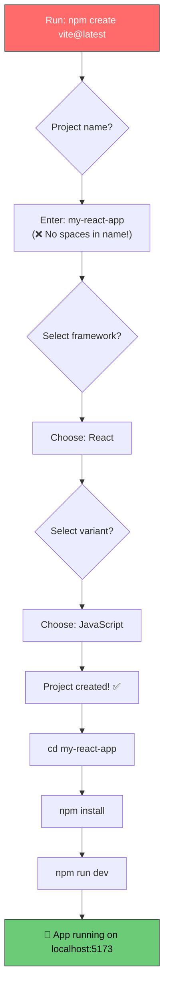
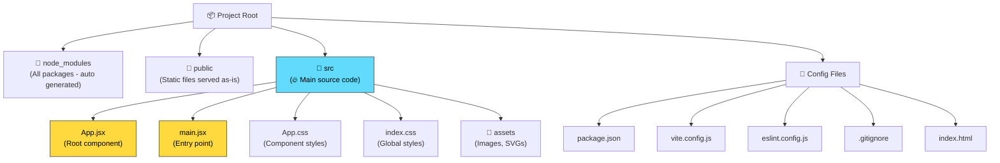
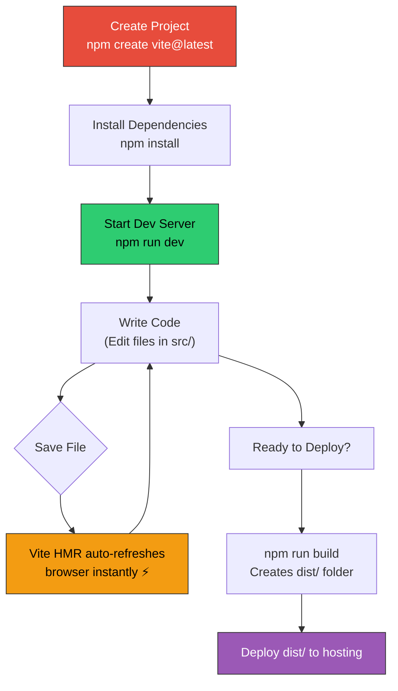

# 📘 React.js - Complete Study Notes (Revision & Interview Prep)

> **Source:** React Introduction Video (College Coders Channel)
> **Purpose:** Quick revision & interview preparation

---

## 📑 Table of Contents

1. [What is React.js?](#1--what-is-reactjs)
2. [Why is React called a "JavaScript Library"?](#2--why-is-react-called-a-javascript-library)
3. [Single Page Applications (SPA)](#3--single-page-applications-spa)
4. [Reusable Components](#4--reusable-components)
5. [Efficient DOM Updates](#5--efficient-dom-updates)
6. [Main Features of React](#6--main-features-of-react)
   - [Component-Based Architecture](#61-component-based-architecture)
   - [JSX (JavaScript XML)](#62-jsx-javascript-xml)
   - [Virtual DOM](#63-virtual-dom)
   - [Reusable Components](#64-reusable-components)
   - [Fast Rendering](#65-fast-rendering)
   - [Easy Integration](#66-easy-integration)
7. [React Project Setup (Using Vite)](#7--react-project-setup-using-vite)
8. [Folder Structure Explained](#8--folder-structure-explained)
9. [Key Files Deep Dive](#9--key-files-deep-dive)
10. [How React Renders - Complete Flow](#10--how-react-renders---complete-flow)
11. [Running a React Project](#11--running-a-react-project)
12. [Interview Questions & Answers](#12--interview-questions--answers)

---

## 1. 📌 What is React.js?

**React.js is a JavaScript library for building user interfaces (UIs).**

### 5 Key Points about React.js

| #  | Point | Explanation |
|----|-------|-------------|
| 1  | **JavaScript Library for Building UIs** | React is used to design and build user interfaces for web applications |
| 2  | **Developed by Facebook** | Facebook created React using JavaScript, simplifying JS disadvantages and adding new features |
| 3  | **Creates Single Page Applications (SPAs)** | Content loads dynamically without full page refresh |
| 4  | **Reusable Components** | UI components can be designed once and reused anywhere in the application |
| 5  | **Updates Only Necessary Parts** | React updates only the changed parts of the webpage instead of reloading the entire page |

### Quick Summary Diagram



---

## 2. 🤔 Why is React Called a "JavaScript Library"?

> **Interview Tip:** This is a frequently asked question!

React is called a **library** (not a framework) because:

- It was **built using JavaScript** by Facebook developers
- It **simplifies JavaScript's disadvantages** and adds new features on top of it
- It focuses **only on the UI layer** (View in MVC), unlike frameworks that handle everything
- You can **use it alongside** other tools and libraries — it doesn't dictate your entire architecture

### Library vs Framework

| Aspect | Library (React) | Framework (Angular) |
|--------|----------------|---------------------|
| **Control** | You call the library | Framework calls your code |
| **Scope** | Focuses on UI only | Full application structure |
| **Flexibility** | Use what you need | Follow the framework's rules |
| **Learning Curve** | Easier to start | Steeper learning curve |
| **Example** | React.js | Angular, Vue.js (framework-like) |

```
📦 JavaScript (Base Language)
 └── 📚 React.js (Library built on JavaScript)
      ├── Simplifies DOM manipulation
      ├── Adds Component-based architecture
      ├── Introduces Virtual DOM
      ├── Adds JSX syntax
      └── Provides state management hooks
```

---

## 3. 🖥️ Single Page Applications (SPA)

### What is an SPA?

> **Definition:** A Single Page Application loads content **dynamically** without refreshing the entire page.

### How SPAs Work



### Real-World Example: YouTube

YouTube is a **Single Page Application**:

1. When you open YouTube, the page loads initially
2. When you click on **Subscriptions** → a channel opens — **page does NOT refresh** ✅
3. When you click on another channel → content updates dynamically — **page does NOT refresh** ✅
4. The **refresh button** in the browser **never spins** during navigation

### SPA vs Traditional Multi-Page Application

| Feature | SPA (React) | Traditional MPA |
|---------|-------------|-----------------|
| **Page Reload** | ❌ No full reload | ✅ Full reload on every navigation |
| **Speed** | ⚡ Fast after initial load | 🐢 Slower — reloads everything |
| **User Experience** | 😊 Smooth, app-like feel | 😐 Page flickers on navigation |
| **Data Loading** | Fetches only needed data | Fetches entire new page |
| **Examples** | YouTube, Gmail, Facebook | Traditional blogs, Wikipedia |

### Code Example — SPA Behavior with React Router

```jsx
// In a React SPA, navigation happens WITHOUT page reload
import { BrowserRouter, Routes, Route, Link } from 'react-router-dom';

function App() {
  return (
    <BrowserRouter>
      {/* Navigation links — clicking these does NOT reload the page */}
      <nav>
        <Link to="/">Home</Link>
        <Link to="/about">About</Link>
        <Link to="/contact">Contact</Link>
      </nav>

      {/* Only this section updates when you navigate */}
      <Routes>
        <Route path="/" element={<Home />} />
        <Route path="/about" element={<About />} />
        <Route path="/contact" element={<Contact />} />
      </Routes>
    </BrowserRouter>
  );
}
```

---

## 4. ♻️ Reusable Components

### What Are Reusable Components?

> **Definition:** Components are **independent, reusable UI building blocks** that can be designed once and used anywhere in the application.

### Real-World Example — Resume Button

Imagine a **Portfolio Website** with a "Download Resume" button:

```
┌─────────────────────────────────────────┐
│  HEADER    [Logo]  [Nav]  [Resume] 📥   │  ← Resume button used here
├─────────────────────────────────────────┤
│                                         │
│  HERO SECTION                           │
│  "Hi, I'm a Developer"                 │
│  [Resume] 📥                            │  ← Same button reused here
│                                         │
├─────────────────────────────────────────┤
│  ABOUT | PROJECTS | CONTACT            │
├─────────────────────────────────────────┤
│  FOOTER    [Social Links]  [Resume] 📥  │  ← Same button reused here
└─────────────────────────────────────────┘
```

The `ResumeButton` component is **designed once** but **used in 3 different places**!

### Code Example

```jsx
// ✅ ResumeButton.jsx — Define ONCE
function ResumeButton() {
  return (
    <a href="/resume.pdf" download className="resume-btn">
      📥 Download Resume
    </a>
  );
}

export default ResumeButton;
```

```jsx
// ✅ Use it ANYWHERE — Header.jsx
import ResumeButton from './ResumeButton';

function Header() {
  return (
    <header>
      <h1>My Portfolio</h1>
      <ResumeButton />   {/* Reused here! */}
    </header>
  );
}
```

```jsx
// ✅ Use it ANYWHERE — Footer.jsx
import ResumeButton from './ResumeButton';

function Footer() {
  return (
    <footer>
      <p>Contact me</p>
      <ResumeButton />   {/* Reused here too! */}
    </footer>
  );
}
```

---

## 5. ⚡ Efficient DOM Updates

> React updates **only the necessary parts** of the web page **instead of reloading the entire page**.

### Example — Movie List "Show More" Button

```
BEFORE clicking "Show More":          AFTER clicking "Show More":
┌──────────────────────────┐         ┌──────────────────────────┐
│  🎬 Movie 1             │         │  🎬 Movie 1             │  (unchanged)
│  🎬 Movie 2             │         │  🎬 Movie 2             │  (unchanged)
│  🎬 Movie 3             │         │  🎬 Movie 3             │  (unchanged)
│                          │         │  🎬 Movie 4             │  ← NEW ✅
│  [Show More]             │         │  🎬 Movie 5             │  ← NEW ✅
│                          │         │  🎬 Movie 6             │  ← NEW ✅
└──────────────────────────┘         │  [Show More]             │
                                     └──────────────────────────┘

❌ Page did NOT refresh
✅ Only the new movies section was updated
```

---

## 6. 🚀 Main Features of React

### 6.1 Component-Based Architecture

> **Apps are built using small, independent, reusable pieces called components.**



### Benefits of Component-Based Architecture:

- **Divide & Conquer** — Break complex UI into small manageable pieces
- **Reusability** — Use the same component in multiple places
- **Maintainability** — Fix/update one component without affecting others
- **Team Collaboration** — Different developers can work on different components

### Code Example

```jsx
// Each section is an independent component
function App() {
  return (
    <div>
      <Header />      {/* Component 1 */}
      <HeroSection />  {/* Component 2 */}
      <About />        {/* Component 3 */}
      <Projects />     {/* Component 4 */}
      <Contact />      {/* Component 5 */}
      <Footer />       {/* Component 6 */}
    </div>
  );
}
```

---

### 6.2 JSX (JavaScript XML)

> **JSX lets you write HTML-like code inside JavaScript files.**

#### What is JSX?

- JSX stands for **J**ava**S**cript **X**ML
- Files use the `.jsx` extension (e.g., `App.jsx`, `main.jsx`)
- It allows **combining HTML code and JavaScript code** in a single file

#### JSX vs Regular JavaScript

```jsx
// ✅ WITH JSX (React way) — Clean & Readable
function Greeting() {
  const name = "Nihar";
  return (
    <div>
      <h1>Hello, {name}!</h1>
      <p>Welcome to React</p>
    </div>
  );
}
```

```javascript
// ❌ WITHOUT JSX (Plain JavaScript) — Verbose & Complex
function Greeting() {
  const name = "Nihar";
  const div = document.createElement('div');
  const h1 = document.createElement('h1');
  h1.textContent = `Hello, ${name}!`;
  const p = document.createElement('p');
  p.textContent = 'Welcome to React';
  div.appendChild(h1);
  div.appendChild(p);
  return div;
}
```

#### JSX Rules

| Rule | Correct ✅ | Wrong ❌ |
|------|-----------|---------|
| Must have one parent element | `<div>...</div>` or `<>...</>` | Multiple root elements |
| Close all tags | ``, `<br />` | ``, `<br>` |
| Use `className` instead of `class` | `<div className="box">` | `<div class="box">` |
| JavaScript expressions in `{}` | `<p>{name}</p>` | `<p>name</p>` |
| Use `htmlFor` instead of `for` | `<label htmlFor="id">` | `<label for="id">` |

---

### 6.3 Virtual DOM

> ⭐ **This is one of the most important interview topics!**

#### What is the DOM?

**DOM = Document Object Model** — A tree-like representation of your web page that the browser creates from HTML.

#### What is the Virtual DOM?

> **Virtual DOM = A lightweight copy (clone) of the Real DOM kept in memory by React.**

#### How Virtual DOM Works — Step by Step



#### Virtual DOM vs Real DOM

| Feature | Virtual DOM | Real DOM |
|---------|-------------|----------|
| **What is it?** | A JavaScript copy of the real DOM | The actual browser DOM |
| **Speed** | ⚡ Very fast to update | 🐢 Slow to update |
| **Updates** | Only changed elements | Re-renders entire tree |
| **Memory** | Lightweight JS object | Heavy browser object |
| **Direct UI update?** | ❌ No (it's in memory) | ✅ Yes (visible to user) |

#### Example — How Virtual DOM Saves Time

```
Scenario: User clicks "Show More" to load 3 new movies

❌ WITHOUT Virtual DOM (Plain JavaScript):
   → Browser re-renders the ENTIRE page
   → Slow, causes flickering
   → Bad user experience

✅ WITH Virtual DOM (React):
   Step 1: React creates new Virtual DOM with 3 extra movies
   Step 2: Compares with old Virtual DOM (Diffing)
   Step 3: Finds: "Only 3 new movie elements added"
   Step 4: Updates ONLY those 3 elements in Real DOM
   → Lightning fast ⚡
   → No flickering
   → Smooth experience
```

> 💡 **Key Point for Interviews:** Virtual DOM = Copy of Real DOM. React first updates the Virtual DOM (fast), then syncs only the changes to the Real DOM. This process is called **Reconciliation**.

---

### 6.4 Reusable Components

*(Covered in detail in [Section 4](#4-️-reusable-components))*

- Build a component once → Use it anywhere
- Example: A `Button`, `Card`, or `Navbar` component used across multiple pages
- Saves development time and ensures consistency

---

### 6.5 Fast Rendering

> **Only the changed part of the web page gets updated — powered by Virtual DOM.**

```
┌─────────────────────────────────┐
│  Header      (unchanged) ──────│──── ❌ NOT re-rendered
│  Navigation  (unchanged) ──────│──── ❌ NOT re-rendered
│  ┌───────────────────────────┐ │
│  │  Movie List  (CHANGED!) ──│─│──── ✅ ONLY this re-renders!
│  │  + 3 new movies added     │ │
│  └───────────────────────────┘ │
│  Footer      (unchanged) ──────│──── ❌ NOT re-rendered
└─────────────────────────────────┘
```

---

### 6.6 Easy Integration

> React can be **easily integrated** with other frameworks or plain JavaScript projects.

#### Integration Examples:



- A React **movie website** + a JavaScript **payment gateway** → Easy to integrate together
- React components can be embedded into existing **jQuery** or **vanilla JS** projects
- Works seamlessly with backend frameworks like **Node.js, Django, Spring Boot**

---

## 7. 🛠️ React Project Setup (Using Vite)

### Prerequisites

1. **Install Node.js** — Download from [nodejs.org](https://nodejs.org)
2. **Verify installation** — Run in terminal:

```bash
node -v      # Should show version like: v20.x.x
npm -v       # Should show version like: 10.x.x
```

### Create a New React Project

```bash
# Step 1: Navigate to your project folder
# Step 2: Run this command:
npm create vite@latest
```

### Setup Flow



### Important Notes During Setup

| ⚠️ Tip | Details |
|--------|---------|
| **No spaces in project name** | Use hyphens: `my-project` ✅ , NOT `my project` ❌ |
| **Package name prompt** | If you accidentally use spaces, it asks for a separate package name — use hyphens there too |
| **Select React** | When asked for framework, select **React** |
| **Select JavaScript** | When asked for variant, select **JavaScript** (not TypeScript for beginners) |

### After Setup — Install & Run

```bash
# Install dependencies (creates node_modules folder)
npm install     # or shorthand: npm i

# Start the development server
npm run dev     # App opens at http://localhost:5173
```

---

## 8. 📂 Folder Structure Explained

After creating a React project with Vite, this is the folder structure:

```
my-react-app/
├── 📁 node_modules/        ← All installed packages (DO NOT EDIT)
├── 📁 public/              ← Static assets (favicon, images)
│   └── favicon.svg
├── 📁 src/                 ← 🔥 YOUR MAIN WORKING DIRECTORY
│   ├── 📁 assets/          ← Images, fonts, etc.
│   │   └── react.svg
│   ├── 📄 App.jsx          ← Main App component
│   ├── 📄 App.css          ← Styles for App component
│   ├── 📄 main.jsx         ← Entry point (renders App)
│   └── 📄 index.css        ← Global styles
├── 📄 .gitignore           ← Files to exclude from Git
├── 📄 eslint.config.js     ← Code quality rules
├── 📄 index.html           ← Main HTML file (entry point)
├── 📄 package.json         ← Project config & dependencies
├── 📄 package-lock.json    ← Locked dependency versions
├── 📄 vite.config.js       ← Vite build tool configuration
└── 📄 README.md            ← Project documentation
```

### Folder Details



---

## 9. 📝 Key Files Deep Dive

### 9.1 `index.html` — The Entry Point

> This is the **only HTML file** in the entire React application (because it's an SPA!)

```html
<!DOCTYPE html>
<html lang="en">
  <head>
    <meta charset="UTF-8" />
    <link rel="icon" type="image/svg+xml" href="/favicon.svg" />
    <meta name="viewport" content="width=device-width, initial-scale=1.0" />
    <title>My React App</title>
  </head>
  <body>
    <!-- 👇 This is where the ENTIRE React app gets mounted -->
    <div id="root"></div>

    <!-- 👇 This script loads our React application -->
    <script type="module" src="/src/main.jsx"></script>
  </body>
</html>
```

**Key Points:**
- Contains `<div id="root">` — React renders everything **inside** this div
- Has a `<script>` tag pointing to `main.jsx` — the JavaScript entry point
- This is the **only HTML page** — everything else is handled by React components

---

### 9.2 `main.jsx` — The JavaScript Entry Point

> This file **connects React to the HTML** by rendering the App component into the `root` div.

```jsx
import { StrictMode } from 'react'
import { createRoot } from 'react-dom/client'
import './index.css'
import App from './App.jsx'

// Find the <div id="root"> in index.html and render our React app into it
createRoot(document.getElementById('root')).render(
  <StrictMode>
    <App />
  </StrictMode>,
)
```

**Key Points:**
- `createRoot()` — Creates a React root connected to the `<div id="root">`
- `StrictMode` — A development tool that highlights potential problems (does nothing in production)
- `<App />` — The main/root component that contains our entire application

---

### 9.3 `App.jsx` — The Root Component

> This is your **main component** where you build your application UI.

```jsx
import './App.css'

function App() {
  return (
    <>
      <h1>Hello World!</h1>
      <p>Welcome to my React App</p>
    </>
  )
}

export default App
```

**Key Points:**
- Uses **JSX syntax** — HTML inside JavaScript
- `<> </>` — This is a **Fragment** (empty wrapper when you don't need an extra div)
- `export default App` — Makes this component available for import in other files

---

### 9.4 `package.json` — Project Configuration

```json
{
  "name": "my-react-app",
  "private": true,
  "version": "0.0.0",
  "type": "module",
  "scripts": {
    "dev": "vite",              // 👈 npm run dev → starts development server
    "build": "vite build",      // 👈 npm run build → creates production bundle
    "lint": "eslint .",         // 👈 npm run lint → checks code quality
    "preview": "vite preview"   // 👈 npm run preview → preview production build
  },
  "dependencies": {
    "react": "^19.x.x",         // 👈 Core React library
    "react-dom": "^19.x.x"      // 👈 React DOM rendering library
  },
  "devDependencies": {
    "@vitejs/plugin-react": "^6.x.x",  // 👈 Vite plugin for React
    "vite": "^8.x.x",                  // 👈 Build tool
    "eslint": "^10.x.x"                // 👈 Code linter
  }
}
```

**Key Points:**
- `scripts` — Commands you can run with `npm run <script-name>`
- `dependencies` — Packages needed to **run** the app
- `devDependencies` — Packages needed only during **development**

---

### 9.5 `vite.config.js` — Build Tool Configuration

```javascript
import { defineConfig } from 'vite'
import react from '@vitejs/plugin-react'

export default defineConfig({
  plugins: [react()],    // Enables React support in Vite
})
```

---

### 9.6 Other Important Files

| File | Purpose |
|------|---------|
| **`node_modules/`** | Contains all installed npm packages. **Never edit manually.** Auto-generated by `npm install`. Added to `.gitignore` |
| **`.gitignore`** | Lists files/folders Git should ignore (e.g., `node_modules/`, `dist/`) |
| **`package-lock.json`** | Locks exact versions of all dependencies for consistent installs across machines |
| **`eslint.config.js`** | Configuration for ESLint — a tool that finds and fixes code quality issues |
| **`App.css`** | CSS styles specific to the `App` component |
| **`index.css`** | Global CSS styles applied to the entire application |

---

## 10. 🔄 How React Renders — Complete Flow

```mermaid
flowchart LR
    A["📄 index.html\n(Browser loads this)"] --> B["Has div id='root'\n+ script tag"]
    B --> C["📄 main.jsx\n(Script entry point)"]
    C --> D["createRoot()\nfinds 'root' div"]
    D --> E[".render()\nrenders App component"]
    E --> F["📄 App.jsx\n(Root component)"]
    F --> G["Returns JSX\n(HTML-like code)"]
    G --> H["🖥️ Browser displays\nthe UI"]

    style A fill:#e74c3c,stroke:#333,color:#fff
    style C fill:#f39c12,stroke:#333,color:#000
    style F fill:#3498db,stroke:#333,color:#fff
    style H fill:#2ecc71,stroke:#333,color:#000
```



### Step-by-Step Flow:

```
1. Browser loads 📄 index.html
        ↓
2. Finds <div id="root"></div> (empty container)
        ↓
3. Finds <script src="/src/main.jsx"> (loads JavaScript)
        ↓
4. 📄 main.jsx runs:
   • Imports App component from App.jsx
   • Calls createRoot(document.getElementById('root'))
   • Calls .render(<App />) to mount the app
        ↓
5. 📄 App.jsx returns JSX (UI code)
        ↓
6. React converts JSX → Virtual DOM → Real DOM
        ↓
7. 🖥️ Browser displays the rendered UI inside <div id="root">
```

---

## 11. ▶️ Running a React Project

### Essential Commands

```bash
# 1. Install dependencies (run once after cloning/creating project)
npm install          # or: npm i

# 2. Start development server (daily development)
npm run dev          # Opens at http://localhost:5173

# 3. Build for production (before deployment)
npm run build        # Creates optimized 'dist' folder

# 4. Preview production build locally
npm run preview      # Preview the built app

# 5. Run linter to check code quality
npm run lint
```

### Development Workflow



> 💡 **HMR (Hot Module Replacement):** When you save a file, Vite instantly updates the browser without a full page reload. This makes development super fast!

---

## 12. 💼 Interview Questions & Answers

### Q1: What is React.js?
**A:** React.js is an open-source **JavaScript library** developed by **Facebook** for building **user interfaces**, especially **Single Page Applications**. It follows a **component-based architecture** and uses a **Virtual DOM** for efficient rendering.

---

### Q2: Why is React called a Library and not a Framework?
**A:** React is called a **library** because it focuses **only on the UI layer** (the View in MVC). It gives developers the freedom to choose other tools for routing, state management, etc. A **framework** (like Angular) provides a complete solution and dictates the application structure.

---

### Q3: What is a Single Page Application (SPA)?
**A:** An SPA is a web application that loads a **single HTML page** and dynamically updates content **without refreshing the entire page**. React achieves this by updating only the necessary DOM elements when data changes. **Examples:** YouTube, Gmail, Facebook.

---

### Q4: What is JSX?
**A:** JSX stands for **JavaScript XML**. It's a syntax extension that lets you write **HTML-like code inside JavaScript**. JSX makes React code more readable and easier to write. Files using JSX have the `.jsx` extension.

```jsx
// JSX Example
const element = <h1>Hello, {name}!</h1>;
```

---

### Q5: What is the Virtual DOM? How does it work?
**A:** The Virtual DOM is a **lightweight JavaScript copy of the Real DOM**. When state changes:
1. React creates a **new Virtual DOM tree**
2. **Compares** it with the previous Virtual DOM (**Diffing Algorithm**)
3. Identifies the **minimum changes** needed
4. Updates **only those changes** in the Real DOM (**Reconciliation**)

This makes React much **faster** than direct DOM manipulation.

---

### Q6: What is Component-Based Architecture?
**A:** In React, the entire UI is divided into **small, independent, reusable pieces called components**. Each component manages its own logic and rendering. Components can be **nested**, **composed**, and **reused** across the application.

```jsx
// Component hierarchy
<App>
  <Header />
  <MainContent />
  <Footer />
</App>
```

---

### Q7: What are Reusable Components?
**A:** Reusable components are UI elements that are **designed once** and can be **used multiple times** throughout the application. Example: A `Button` component created once can be used in the Header, Hero section, and Footer.

---

### Q8: What is the difference between Virtual DOM and Real DOM?
**A:**

| Virtual DOM | Real DOM |
|-------------|----------|
| Lightweight JS object | Heavy browser object |
| Updates are fast | Updates are slow |
| Can't directly update UI | Directly updates UI |
| Updates only changed nodes | Re-renders entire tree |
| React manages it | Browser manages it |

---

### Q9: What is Vite? Why use it with React?
**A:** Vite is a **modern build tool** that provides:
- ⚡ **Instant server start** (no bundling needed for dev)
- 🔥 **Hot Module Replacement (HMR)** — instant browser updates
- 📦 **Optimized production builds**
- It's much **faster** than older tools like Create React App (CRA)

---

### Q10: What is the role of `index.html`, `main.jsx`, and `App.jsx`?
**A:**
| File | Role |
|------|------|
| `index.html` | The single HTML page with `<div id="root">` where React mounts |
| `main.jsx` | Entry point that uses `createRoot()` to render the App into the root div |
| `App.jsx` | The root React component containing the main application UI |

**Flow:** `index.html` → loads `main.jsx` → renders `App.jsx` → displayed in browser

---

### Q11: What is `StrictMode` in React?
**A:** `StrictMode` is a **development-only tool** that:
- Highlights potential problems in your app
- Detects unsafe lifecycle methods
- Warns about deprecated API usage
- **Does nothing in production** — no performance impact

```jsx
<StrictMode>
  <App />
</StrictMode>
```

---

### Q12: What does `npm install` do?
**A:** `npm install` reads the `package.json` file, downloads all listed dependencies, and stores them in the `node_modules/` folder. It also creates/updates `package-lock.json` to lock exact versions.

---

### Q13: What is a Fragment (`<>...</>`) in React?
**A:** A Fragment lets you **group multiple elements without adding extra nodes** to the DOM. Instead of wrapping elements in a `<div>`, you use `<>...</>` (shorthand) or `<React.Fragment>...</React.Fragment>`.

```jsx
// ✅ Fragment — no extra div in DOM
return (
  <>
    <h1>Title</h1>
    <p>Description</p>
  </>
);

// ❌ Without Fragment — adds unnecessary div
return (
  <div>
    <h1>Title</h1>
    <p>Description</p>
  </div>
);
```

---

## 📋 Quick Revision Cheat Sheet

```
┌─────────────────────────────────────────────────────────────┐
│                    REACT.JS CHEAT SHEET                     │
├─────────────────────────────────────────────────────────────┤
│                                                             │
│  ✅ React = JavaScript LIBRARY (not framework)              │
│  ✅ Built by Facebook for building UIs                      │
│  ✅ Creates Single Page Applications (SPAs)                 │
│  ✅ Component-Based Architecture (divide & conquer)         │
│  ✅ Uses JSX = JavaScript + HTML combined                   │
│  ✅ Virtual DOM = Copy of Real DOM (fast updates)           │
│  ✅ Reusable Components = Build once, use anywhere          │
│  ✅ Fast Rendering = Only changed parts update              │
│  ✅ Easy Integration with other frameworks/libraries        │
│                                                             │
│  📦 Setup: npm create vite@latest                           │
│  📂 Work in: src/ folder                                    │
│  ▶️  Run: npm run dev                                       │
│  🔄 Flow: index.html → main.jsx → App.jsx → Browser        │
│                                                             │
│  🔑 Key Concept: Virtual DOM                                │
│     State Change → New VDOM → Diff → Update Real DOM        │
│     (This process = Reconciliation)                         │
│                                                             │
└─────────────────────────────────────────────────────────────┘
```

---

> 📚 **Next:** Check the `DAY-2` and `DAY-3` folders for more advanced React concepts!

---

*Notes prepared from College Coders YouTube Channel — React Introduction Video*
