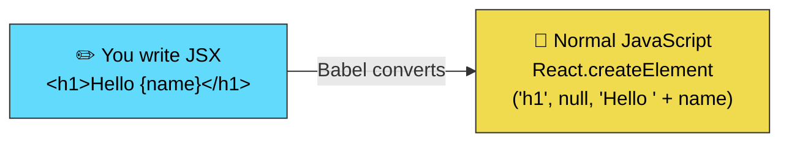
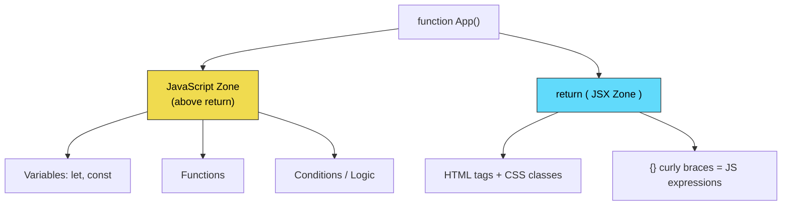
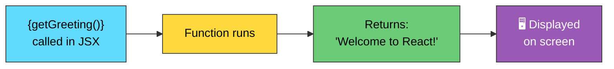
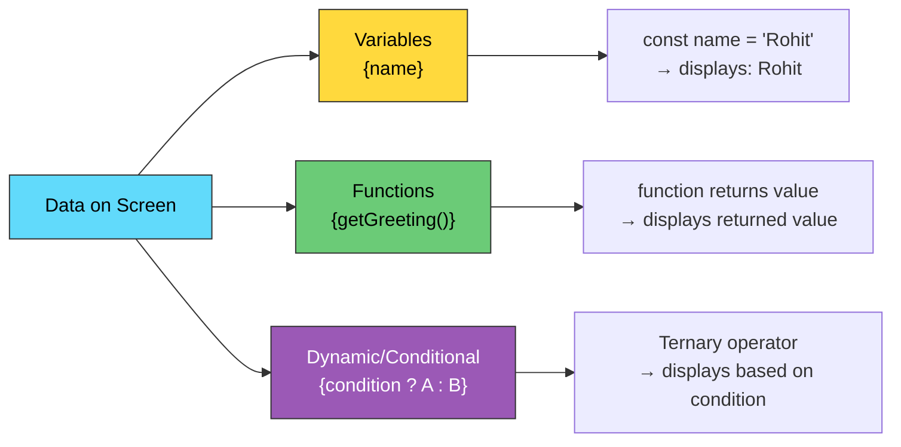
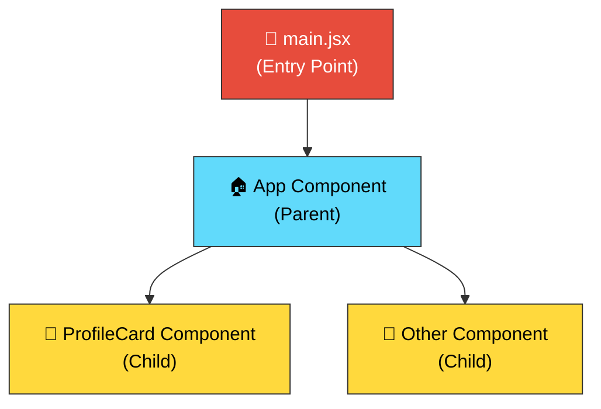
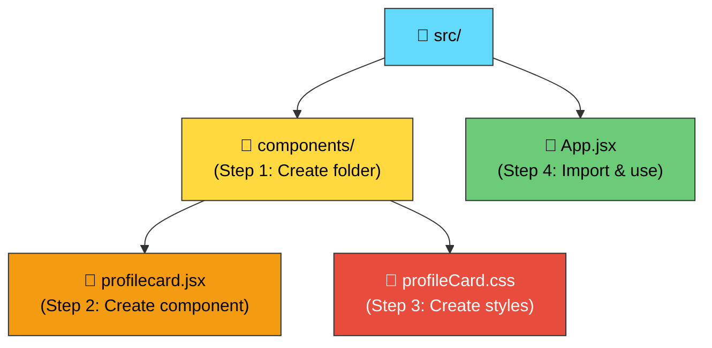
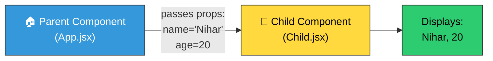
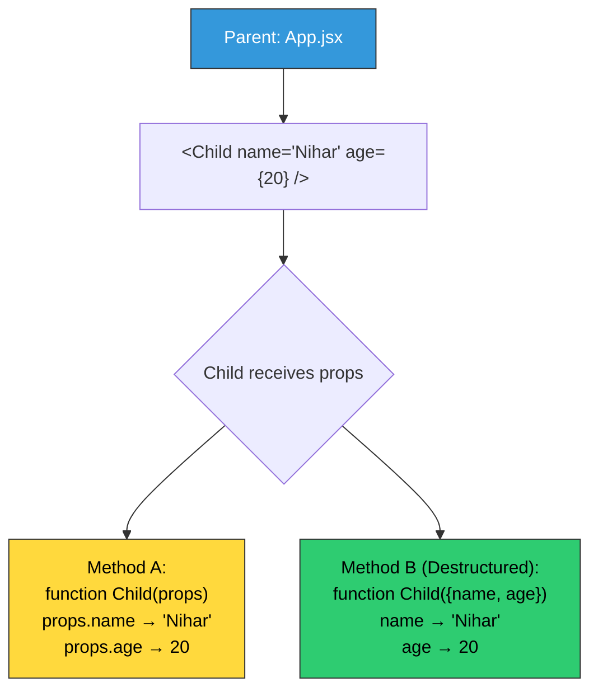
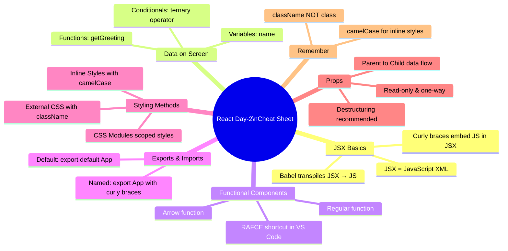

# 📘 React.js — Day 2 Detailed Notes (Revision & Interview Prep)

> **Source:** College Coders YouTube Channel — React Video 2
> **Topics Covered:** JSX deep-dive, Babel, Data rendering, Functional Components, Exports & Imports, Styling, Props

---

## 📑 Table of Contents

| # | Topic |
|---|-------|
| 1 | [What is JSX? (Deep Dive)](#1--what-is-jsx-deep-dive) |
| 2 | [How JavaScript is Written Inside JSX](#2--how-javascript-is-written-inside-jsx) |
| 3 | [How Data Appears on Screen](#3--how-data-appears-on-screen) |
| 4 | [Functional Components](#4--functional-components) |
| 5 | [Export & Import (Default vs Named)](#5--export--import-default-vs-named) |
| 6 | [Creating a Reusable Component (Profile Card)](#6--creating-a-reusable-component-profile-card) |
| 7 | [Styling in React (3 Methods)](#7--styling-in-react-3-methods) |
| 8 | [Props (Properties)](#8--props-properties) |
| 9 | [Interview Questions & Answers](#9--interview-questions--answers) |
| 10 | [Quick Revision Cheat Sheet](#10--quick-revision-cheat-sheet) |

---

## 1. 🔥 What is JSX? (Deep Dive)

### 4 Key Points About JSX

| # | Point | Explanation |
|---|-------|-------------|
| 1 | **JSX = JavaScript XML** | A syntax extension for JavaScript |
| 2 | **Write HTML inside JavaScript** | Combine HTML markup + JS logic in one `.jsx` file |
| 3 | ⭐ **React converts JSX → normal JS using Babel** | Babel is a **transpiler** that converts JSX code into plain JavaScript so browsers can understand it |
| 4 | **More readable & easier to write** | JSX simplifies code compared to raw `document.createElement` chains |

### How JSX → Browser Actually Works


### What is Babel?

> ⭐ **Interview Must-Know!** — *"If you attend a React interview, they will definitely ask about Babel."*

**Babel** is a **transpiler (trans-compiler)** that:
- Takes the JSX code you write in `.jsx` files
- Converts it into **normal JavaScript** behind the scenes (under the hood)
- The converted JS is what actually runs in the browser



> 💡 **Why is this needed?** Browsers don't understand JSX natively. They only understand HTML, CSS, and JavaScript. Babel bridges this gap.

### Why JSX is Easier — React vs Plain JavaScript

**Task:** Display a person's name and age dynamically on a web page.

#### ❌ Plain JavaScript — Verbose & Complex (2 approaches)

**Approach 1: innerHTML**
```html
<body>
  <div id="root"></div>
  <script>
    let name = "Rohit";
    const age = 21;
    const root = document.getElementById("root");
    root.innerHTML = `
      <h2>Hello, ${name}</h2>
      <p>You are ${age} years old</p>
    `;
  </script>
</body>
```

**Approach 2: createElement + textContent**
```html
<body>
  <h2 id="heading"></h2>
  <p id="para"></p>
  <script>
    let name = "Rohit";
    const age = 21;
    document.getElementById("heading").textContent = `Hello, ${name}`;
    document.getElementById("para").textContent = `You are ${age} years old`;
  </script>
</body>
```

#### ✅ React JSX — Simple & Clean

```jsx
function App() {
  let name = "Rohit";
  const age = 21;

  return (
    <div>
      <h2>Hello, {name}</h2>
      <p>You are {age} years old</p>
    </div>
  );
}
```

> 🎯 **Key Takeaway:** In JSX, you just use `{variableName}` inside HTML tags — no `getElementById`, no `innerHTML`, no template literals with backticks needed.

---

## 2. ✍️ How JavaScript is Written Inside JSX

### The Rule: Curly Braces `{}`

> In JSX, **anything inside `{}` (curly braces / flower brackets)** is treated as a **JavaScript expression**.

### Where to Write JS Code in a Component

```jsx
function App() {
  // ────────────────────────────────────────────
  // 👆 JAVASCRIPT ZONE — write variables,
  //    functions, logic ABOVE the return
  // ────────────────────────────────────────────

  let name = "Rohit";         // ← JS variable
  const age = 21;              // ← JS variable
  
  // ────────────────────────────────────────────
  // 👇 JSX ZONE — return HTML with {JS} embedded
  // ────────────────────────────────────────────

  return (
    <div>
      <h2>Hello, {name}</h2>       {/* ← JS inside HTML using {} */}
      <p>You are {age} years old</p>
    </div>
  );
}
```



### Example from Your Code

```jsx
// File: DAY-2/src/App.jsx
function App() {
  let name = "Nihar";      // JS variable
  const age = 21;           // JS variable

  return (
    <div>
      <h1>Hello {name}</h1>           {/* Output: Hello Nihar */}
      <p>You are {age} years old.</p>  {/* Output: You are 21 years old. */}
    </div>
  );
}
```

---

## 3. 📊 How Data Appears on Screen

There are **3 ways** data can appear dynamically on screen in JSX:

### 3.1 Using Variables

```jsx
function App() {
  const city = "Hyderabad";

  return <h1>I live in {city}</h1>;
  // Output: I live in Hyderabad
}
```

### 3.2 Using Functions

> Call a function inside `{}` and whatever it **returns** gets displayed.

```jsx
function App() {

  function getGreeting() {
    return "Welcome to React!";
  }

  return (
    <div>
      {getGreeting()}       {/* Output: Welcome to React! */}
    </div>
  );
}
```

**How it works:**



### 3.3 Using Dynamic Values (Ternary Operator / Conditional Expressions)

> Use the **ternary operator** `condition ? ifTrue : ifFalse` inside `{}` to show different content based on a condition.

```jsx
function App() {
  const isLoggedIn = true;

  return (
    <div>
      {isLoggedIn ? <h1>Welcome back!</h1> : <h1>Please Login</h1>}
    </div>
  );
}
// If isLoggedIn = true  → shows "Welcome back!"
// If isLoggedIn = false → shows "Please Login"
```

### Visual Summary



---

## 4. 🧩 Functional Components

### What is a Functional Component?

> A **functional component** is a **JavaScript function that returns JSX (HTML-like code)**.

### Two Ways to Create Components

#### Way 1: Regular Function

```jsx
function App() {
  return (
    <div>
      <h1>Hello World</h1>
    </div>
  );
}
export default App;
```

#### Way 2: Arrow Function

```jsx
const App = () => {
  return (
    <div>
      <h1>Hello World</h1>
    </div>
  );
};
export default App;
```

### RAFCE Shortcut (VS Code)

> Type `rafce` in a `.jsx` file and press **Enter** → VS Code auto-generates a full React component boilerplate!

```jsx
// What RAFCE generates:
import React from 'react'

const ComponentName = () => {
  return (
    <div>ComponentName</div>
  )
}

export default ComponentName
```

### Rules for Components

| Rule | Correct ✅ | Wrong ❌ |
|------|-----------|---------|
| Name must start with **uppercase** (PascalCase) | `ProfileCard`, `App` | `profileCard`, `app` |
| Must return **JSX** | `return (<div>...</div>)` | returning nothing |
| One **root element** in return | `<div>...</div>` or `<>...</>` | multiple sibling roots |
| Store in **separate files** (best practice) | `components/ProfileCard.jsx` | everything in App.jsx |

### Component Architecture Diagram



---

## 5. 📦 Export & Import (Default vs Named)

### Default Export

> **One default export** per file. Can be imported with **any name**.

```jsx
// 📄 ProfileCard.jsx — EXPORTING
function ProfileCard() {
  return <div>Profile Card</div>;
}
export default ProfileCard;    // ← default export
```

```jsx
// 📄 App.jsx — IMPORTING
import ProfileCard from './components/ProfileCard';   // ✅ no curly braces
import Card from './components/ProfileCard';           // ✅ any name works!
```

### Named Export

> **Multiple named exports** per file. Must use **exact name** with `{}`.

```jsx
// 📄 utils.jsx — EXPORTING
export function greet() { return "Hello"; }        // ← named export
export function farewell() { return "Goodbye"; }   // ← named export
```

```jsx
// 📄 App.jsx — IMPORTING
import { greet, farewell } from './utils';   // ✅ must use {} and exact names
```

### Comparison Table

| Feature | Default Export | Named Export |
|---------|--------------|-------------|
| **Syntax (export)** | `export default Component` | `export function Component` or `export { Component }` |
| **Syntax (import)** | `import Anything from './path'` | `import { ExactName } from './path'` |
| **Curly braces?** | ❌ No | ✅ Yes `{}` |
| **Rename on import?** | ✅ Freely | Needs `as` keyword |
| **How many per file?** | Only 1 | Unlimited |

---

## 6. 🪪 Creating a Reusable Component (Profile Card)

### Step-by-Step Process



### Step 2 — Component File

```jsx
// 📄 src/components/profilecard.jsx
import "./profileCard.css"

function Profilecard() {
  const name = "Nihar";
  const age = 21;
  const country = "India";

  return (
    <div className="card">        {/* ⚠️ className, NOT class */}
      <p>Name: {name}</p>
      <p>Age: {age}</p>
      <p>Country: {country}</p>
    </div>
  );
}

export default Profilecard;
```

### Step 3 — Component CSS

```css
/* 📄 src/components/profileCard.css */
.card {
  border: 2px solid black;
  padding: 20px;
  width: 250px;
  border-radius: 10px;
  background-color: aliceblue;
}
```

### Step 4 — Use in App.jsx

```jsx
// 📄 src/App.jsx
import "./App.css";
import Profilecard from './components/profilecard';

function App() {
  return (
    <>
      <Profilecard />     {/* Component used like an HTML tag! */}
    </>
  );
}

export default App;
```

> 💡 **Key Point:** `className` is used in JSX instead of `class` (because `class` is a reserved keyword in JavaScript).

---

## 7. 🎨 Styling in React (3 Methods)

### Method 1: External CSS (Separate `.css` File)

> Create a `.css` file and import it into the component.

```css
/* profileCard.css */
.card {
  border: 2px solid black;
  padding: 20px;
  border-radius: 10px;
}
```

```jsx
// profilecard.jsx
import "./profileCard.css";   // ← import CSS file

function Profilecard() {
  return <div className="card">Content</div>;
}
```

### Method 2: Inline Styles

> Pass a **JavaScript object** to the `style` attribute. Property names use **camelCase**.

```jsx
function App() {
  return (
    <div>
      {/* Double curly braces: outer {} = JS expression, inner {} = JS object */}
      <h1 style={{ color: "red", fontSize: "24px", backgroundColor: "yellow" }}>
        Styled Heading
      </h1>
    </div>
  );
}
```

**Or store styles in a variable:**

```jsx
function App() {
  const headingStyle = {
    color: "blue",
    fontSize: "28px",
    textAlign: "center",
  };

  return <h1 style={headingStyle}>Styled Heading</h1>;
}
```

#### CSS vs Inline Style — Property Name Differences

| CSS Property | Inline Style (camelCase) |
|-------------|-------------------------|
| `background-color` | `backgroundColor` |
| `font-size` | `fontSize` |
| `text-align` | `textAlign` |
| `border-radius` | `borderRadius` |
| `margin-top` | `marginTop` |

### Method 3: CSS Modules

> Scoped styles that only apply to a specific component. File named `Component.module.css`.

```css
/* Card.module.css */
.card {
  border: 2px solid blue;
  padding: 15px;
}
```

```jsx
import styles from "./Card.module.css";

function Card() {
  return <div className={styles.card}>Module Styled Card</div>;
}
```

### Comparison of All 3 Methods

| Feature | External CSS | Inline Styles | CSS Modules |
|---------|-------------|---------------|-------------|
| **File** | Separate `.css` file | Inside JSX | `.module.css` file |
| **Scope** | Global (affects all matching classes) | Only that element | Scoped to component |
| **Syntax** | `className="card"` | `style={{ color: "red" }}` | `className={styles.card}` |
| **Best for** | General styling | Quick one-off styles | Avoiding class name conflicts |
| **Pseudo-classes** (`:hover`) | ✅ Supported | ❌ Not supported | ✅ Supported |

---

## 8. 📬 Props (Properties)

### What are Props?

> **Props** = mechanism to **pass data from a Parent component to a Child component**. Think of them as **function arguments** for components.



### Step 1 — Parent sends props

```jsx
// 📄 App.jsx (Parent)
import Child from "./components/Child";

function App() {
  const name = "Nihar";
  const age = 20;

  return (
    <div>
      {/* Passing name & age as props to Child */}
      <Child name={name} age={age} />
    </div>
  );
}

export default App;
```

### Step 2 — Child receives props

#### Method A: Using `props` object

```jsx
// 📄 components/Child.jsx
function Child(props) {
  return (
    <div>
      <p>{props.name}</p>     {/* Access via props.propertyName */}
      <p>{props.age}</p>
    </div>
  );
}

export default Child;
```

#### Method B: Destructuring props (✅ Cleaner — Recommended)

```jsx
// 📄 components/Child.jsx
function Child({ name, age }) {     // ← destructure directly in parameter
  return (
    <div>
      <p>{name}</p>           {/* Use directly — no "props." prefix */}
      <p>{age}</p>
    </div>
  );
}

export default Child;
```

### Props Flow Diagram



### Passing Images as Props (Advanced Example)

```jsx
// 📄 App.jsx (Parent)
import Child from './components/Child';
import image1 from './assets/spiderman.webp';
import image2 from './assets/brand-new-day.jpeg';
import image3 from './assets/nowayhome.jpeg';

function App() {
  return (
    <div>
      <Child img1={image1} img2={image2} img3={image3} />
    </div>
  );
}
```

```jsx
// 📄 components/Child.jsx (Child — Arrow Function + Destructuring)
import "./Child.css";

const Child = ({ img1, img2, img3 }) => {
  return (
    <div className="container">
      <div className="image-card">
        
      </div>
      <div className="image-card">
        
      </div>
      <div className="image-card">
        
      </div>
    </div>
  );
};

export default Child;
```

### Key Rules of Props

| Rule | Detail |
|------|--------|
| **Props are read-only** | A child component **cannot modify** the props it receives |
| **Data flows one way** | Parent → Child only (called **unidirectional data flow**) |
| **Any data type** | You can pass strings, numbers, booleans, arrays, objects, functions, even JSX! |
| **Destructuring is preferred** | `{ name, age }` is cleaner than `props.name, props.age` |

---

## 9. 💼 Interview Questions & Answers

### Q1: What is JSX?
**A:** JSX stands for **JavaScript XML**. It is a syntax extension that allows us to write **HTML-like code inside JavaScript** files (`.jsx`). It makes React code more **readable and easier to write**. Behind the scenes, JSX is converted to normal JavaScript by **Babel**.

---

### Q2: What is Babel? Why is it needed?
**A:** Babel is a **transpiler (trans-compiler)** that converts JSX code into **normal JavaScript** that browsers can understand. Browsers don't understand JSX natively — they only understand plain HTML, CSS, and JS. Babel bridges this gap by converting JSX into `React.createElement()` calls under the hood.

```
JSX:    <h1>Hello</h1>
         ↓ Babel converts
JS:     React.createElement('h1', null, 'Hello')
```

---

### Q3: How do you embed JavaScript in JSX?
**A:** By wrapping JavaScript expressions in **curly braces `{}`** inside the JSX return block.

```jsx
const name = "Rohit";
return <h1>Hello, {name}</h1>;   // Output: Hello, Rohit
```

You can embed **variables**, **function calls**, and **expressions** (like ternary operators) — but NOT statements (`if/else`, `for` loops).

---

### Q4: What is a Functional Component?
**A:** A functional component is a **JavaScript function that returns JSX**. It's the modern and recommended way to create React components.

```jsx
// Regular function
function App() { return <h1>Hello</h1>; }

// Arrow function
const App = () => { return <h1>Hello</h1>; };
```

---

### Q5: What is the difference between Default Export and Named Export?
**A:**

| Default Export | Named Export |
|---------------|-------------|
| `export default App` | `export { App }` |
| Import with **any name**: `import Xyz from './App'` | Import with **exact name** + `{}`: `import { App } from './App'` |
| **Only 1** per file | **Multiple** per file |

---

### Q6: What are Props in React?
**A:** Props (short for **Properties**) are used to **pass data from a parent component to a child component**. They are **read-only** — the child cannot modify them. Data flows in **one direction** (parent → child), which is called **unidirectional data flow**.

```jsx
// Parent passes
<Child name="Nihar" age={20} />

// Child receives
function Child({ name, age }) {
  return <p>{name} is {age} years old</p>;
}
```

---

### Q7: What is the difference between `class` and `className` in React?
**A:** In JSX, we use `className` instead of `class` because `class` is a **reserved keyword** in JavaScript (used for ES6 classes). React internally maps `className` to the HTML `class` attribute.

```jsx
// ✅ Correct (React JSX)
<div className="card">Content</div>

// ❌ Wrong
<div class="card">Content</div>
```

---

### Q8: What are the 3 ways to style React components?
**A:**
1. **External CSS** — Separate `.css` file imported into the component
2. **Inline Styles** — `style={{ color: "red", fontSize: "16px" }}` with camelCase properties
3. **CSS Modules** — `.module.css` files with scoped styles: `className={styles.card}`

---

### Q9: What is Props Destructuring? Why use it?
**A:** Instead of accessing props like `props.name`, `props.age`, we destructure them directly in the function parameter: `({ name, age })`. This makes code **cleaner, shorter, and more readable**.

```jsx
// Without destructuring
function Child(props) {
  return <p>{props.name} - {props.age}</p>;
}

// With destructuring ✅ (cleaner)
function Child({ name, age }) {
  return <p>{name} - {age}</p>;
}
```

---

### Q10: Can you pass images as props?
**A:** Yes! Import the image in the parent and pass it as a prop. The child uses it as the `src` of an `` tag.

```jsx
// Parent
import myImg from './assets/photo.png';
<Child img={myImg} />

// Child
const Child = ({ img }) => ;
```

---

## 10. 📋 Quick Revision Cheat Sheet



---

> 📂 **See also:** `DAY-1/` for React intro basics, `DAY-2/` for JSX & components code, `DAY-3/` for props & image cards code.

---

*Notes prepared from College Coders YouTube Channel — React Video 2*
